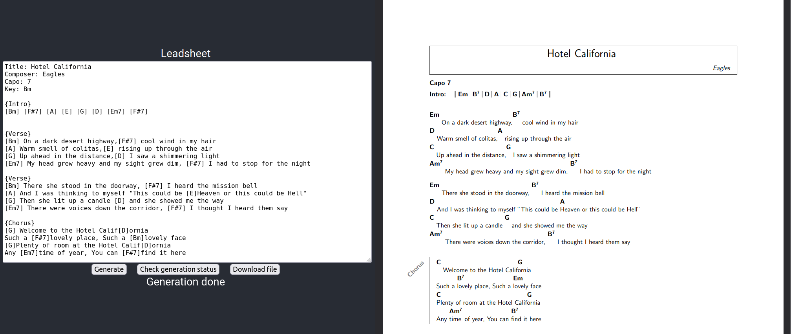

# Go-leadsheet

A web application for editing leadsheets.

Go-leadsheet is still at an early stage of development. The main basic features are developped and I'm currently working on making the app usable. The first version should be out soon !

## About the project
Go-leadsheet is a web application for editing leadsheets, ie. song lyrics and the associated chords.
It provides a web interface for editing leadsheets and downloading them in pdf.

Lyrics and chords can be edited using a simple syntax, similar to what can be found on websites such as ...
The app then parses the lyrics and chords of the song and generates a PDF file using LaTeX.

The back-end of the app is written in Golang and relies on Clemens Niederberger's leadsheets LaTeX package for pdf generation. The front-end is written in React.

## Status

Some features and improvements still need to be added before the first version is released:

### Back-end
- [ ] Create data pipelines for data processing
- [ ] Improve management of temporary files 
- [ ] Make more parameters configurable (eg. ip address)
- [ ] Reduce usage of bash scripts for pdf generation (see gotex)
- [ ] Add missing tests on back-end functions

### Front-end
- [ ] Forward errors from back-end to front-end
- [ ] Automatically pull back-end status

### CI/CD
- [ ] Create docker container for the app
- [ ] Setup CI/CD

## Installation
An installation process will be provided soon !

## Contributing
This repo is still in an early stage of development and is not open for contribution yet.
